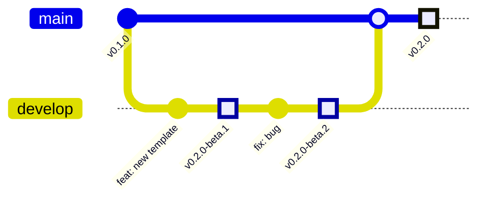

# Atlas Release Guidelines

## Overview

Atlas uses automated semantic versioning with a simple two-branch strategy: `main` (stable) and `develop` (beta). This document explains our release process and why version jumps are normal and acceptable.

## Branch Strategy



### Main Branch (`main`)

- **Purpose**: Stable releases for production use
- **Audience**: End users, CLI downloads
- **Versioning**: Semantic versioning (e.g., `v1.0.0`, `v1.1.0`, `v2.0.0`)
- **Protection**: Only merge from `develop` when features are stable

### Develop Branch (`develop`)

- **Purpose**: Beta releases for testing and feedback
- **Audience**: Early adopters, internal testing
- **Versioning**: Pre-release versions (e.g., `v1.0.0-beta.1`, `v1.1.0-beta.2`)
- **Updates**: Automatic release on every push

## Daily Workflow

### 1. Feature Development

```bash
# Create feature branch from develop
git checkout develop
git pull origin develop
git checkout -b feat/my-new-feature

# Work with conventional commits
git commit -m "feat: add new template generator"
git commit -m "fix: resolve path resolution issue"
git commit -m "docs: update README with new features"
```

### 2. Pull Request to Develop

```bash
# Push feature branch
git push origin feat/my-new-feature

# Create PR to develop branch
# Title: "feat: add new template generator"
# Body: Describe the feature
```

**What happens:**

- PR merges to `develop`
- Semantic-release analyzes commits
- Automatic beta release (e.g., `v0.3.0-beta.1`)
- Available for testing immediately

### 3. Testing Phase

- Beta versions are tested by team and early adopters
- Bug fixes create new beta versions (e.g., `v0.3.0-beta.2`)
- Multiple features can accumulate before stable release

### 4. Stable Release

```bash
# When ready for stable release
git checkout main
git pull origin main

# Create PR from develop to main
# Title: "chore: release v0.3.0 stable"
# Body: List of features being graduated
```

**What happens:**

- Merge check workflow analyzes version jump
- Semantic-release creates stable release (e.g., `v0.3.0`)
- GitHub release with comprehensive changelog
- Users get stable update

## Version Jumps Are Normal

### Why Version Jumps Happen

Version jumps (e.g., `v0.2.0` → `v0.8.0`) occur when:

1. Multiple features are tested together on `develop`
2. Team decides to batch several betas into one stable release
3. Major features require extended testing period

### Why This Is Good

```diff
❌ Bad: Force creating intermediate versions
+ v0.2.0 → v0.3.0 → v0.4.0 → v0.5.0 (artificial, no testing)

✅ Good: Natural progression with testing
+ v0.2.0 → v0.8.0 (well-tested, comprehensive changelog)
```

**Benefits:**

- **Quality**: Each stable release is thoroughly tested
- **Clarity**: Version jumps signal major updates
- **Flexibility**: No pressure to release before ready

### Examples from Major Projects

- **React**: `v18.0.0` → `v18.3.0` (no intermediate stable releases)
- **Next.js**: `v13.0.0` → `v14.0.0` (canary had 100+ versions between)
- **Vue**: `v3.2.0` → `v3.4.0` (next branch evolved independently)

## Commit Message Guidelines

### Format

```
<type>(<scope>): <subject>

<body>

<footer>
```

### Types

| Type       | Release | Example                           |
| ---------- | ------- | --------------------------------- |
| `feat`     | minor   | `feat: add React template`        |
| `fix`      | patch   | `fix: resolve TypeScript imports` |
| `perf`     | patch   | `perf: optimize build process`    |
| `refactor` | patch   | `refactor: simplify config logic` |
| `docs`     | none    | `docs: update installation guide` |
| `style`    | none    | `style: fix formatting`           |
| `test`     | none    | `test: add unit tests`            |
| `chore`    | none    | `chore: update dependencies`      |

### Breaking Changes

```
feat: redesign template structure

BREAKING CHANGE: Template directory structure has changed.
Migration guide available in docs/MIGRATION.md
```

## Release Process

### Automatic (Recommended)

1. **Feature Branch** → **Develop** (creates beta)
2. **Test beta** for 1-2 weeks
3. **Develop** → **Main** (creates stable)

### Manual Override

For hotfixes or special releases:

```bash
# Emergency fix directly to main
git checkout -b hotfix/security-fix main
git commit -m "fix: resolve security vulnerability"

# Creates patch release immediately
```

## Monitoring and Visibility

### Merge Check Workflow

Every PR to `main` gets:

- 📊 Version jump analysis
- ⚠️ Warnings for large jumps (informational only)
- 🔮 Preview of release impact
- 📝 Summary of changes

### Release Notes

Automated release notes include:

- ✨ **Features**: New functionality
- 🐛 **Bug Fixes**: Issues resolved
- ⚡ **Performance**: Speed improvements
- ♻️ **Refactoring**: Code improvements
- 💥 **Breaking Changes**: Migration required

## FAQ

### Q: Should I worry about version gaps?

**A: No.** Version gaps are normal and indicate thorough testing. Users care about stability, not sequential numbers.

### Q: How often should we merge develop to main?

**A: When features are stable.** This might be:

- Weekly for small features
- Monthly for major features
- Quarterly for breaking changes

### Q: What if I need a hotfix?

**A: Create a branch from main**, fix the issue, and merge directly. This creates an immediate patch release.

### Q: Can I skip beta testing?

**A: Not recommended.** The beta channel exists for quality assurance. Even small fixes should be tested.

## Tools and Commands

### Check current versions

```bash
# Main branch version
git show main:package.json | grep version

# Develop branch version
git show develop:package.json | grep version

# All releases
gh release list
```

### Preview release

```bash
# See what semantic-release would do
npx semantic-release --dry-run
```

### Manual release (emergency only)

```bash
# Set environment and run
GITHUB_TOKEN=<token> npx semantic-release --no-ci
```

## Best Practices

### ✅ Do

- Use conventional commits consistently
- Test beta releases before promoting
- Include meaningful commit bodies
- Document breaking changes
- Let semantic-release handle versioning

### ❌ Don't

- Manually edit version numbers
- Skip beta testing for "small" changes
- Worry about version number gaps
- Create artificial intermediate releases
- Override semantic-release decisions

---

**Remember**: This system is designed to be simple, automated, and reliable. Trust the process, test thoroughly, and let semantic-release handle the complexity of versioning.
